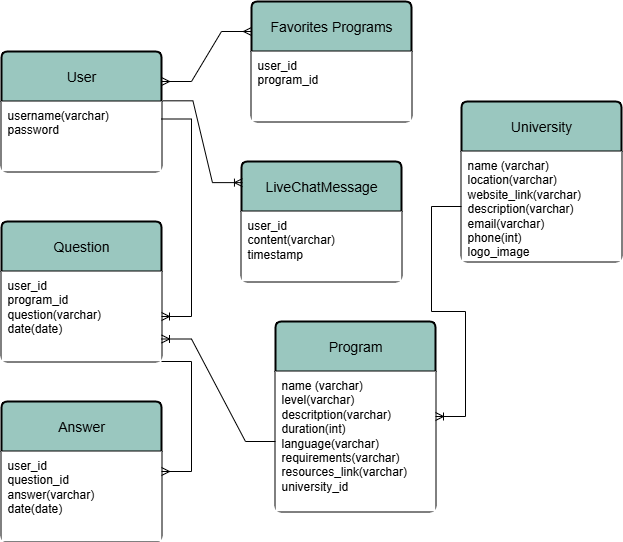

# MASARI

**Date** Aug / 26 / 2025  
**Developed By** [Noor Salman](https://github.com/NOORSALMAN25) | [Yara](https://github.com/Yara-Waleed) | [Fatema Albasri](https://github.com/fatemaAlbasri) 

## Description
Masari provides a complete overview of universities in Bahrain and the majors they offer, all in one place. It allows students to compare institutions, explore detailed information about programs, and make informed choices about their academic future. The platform also enables students to ask questions and receive answers, creating a more supportive and interactive decision-making process. | [Access Masari Here](https://masari-r18y.onrender.com/) |
 
  

## Story Behind Masari
### Built by Students for Students
We understand how overwhelming it can feel to choose the right path for your academic future. With so many options, opinions, and sources of information, it’s easy to get lost in the noise. That’s exactly why Masari was created to simplify the process, give you clarity, and provide the right tools and insights you need to make confident, informed decisions about your education.

## Planning

- **Entity Relationship Diagram (ERD)**: Guide that shows how the database should be structured.
 
  

- **Collaborative Board** [Notion](https://www.notion.so/259272c111118088b111df50c3d44ee6?v=259272c1111180e18c23000cbb3a9654&source=copy_link) : A shared board that lets us track each other’s progress, stay updated on completed work, and easily assign new tasks.
 

 
  

## Technologies Used

- Pyhton 
- Django
- HTML
- CSS
- PostgreSQL
- JavaScript

## Wireframes

A wireframe helps us visualize the overall look of the app before it's developed. It serves as a planning tool to guide the layout, design, and visual structure. 
 
| [Wireframe Photo](https://wireframe.cc/pro/ppp/44619b79c-971139) |

## Future Enhancements
- Personalized Recommendation Quiz
- Program Comparison Tool
- Mobile App Version 
- Multi Language Support

## Credits

- [AIchatbot](https://medium.com/@amitkumat/building-a-chatbot-with-deepseek-ai-and-django-4d6cc5bb7a34)
- [Real time chat](https://medium.com/@farad.dev/how-to-build-a-real-time-chat-app-using-django-channels-2ba2621ea972)
- [Filter](https://www.w3schools.com/django/ref_tags_regroup.php)
- [Icons](https://fonts.google.com/icons?selected=Material+Symbols+Outlined:language:FILL@0;wght@400;GRAD@0;opsz@24&icon.size=24&icon.color=%23e3e3e3&icon.query=website)
- [Interactive Map Leaflet](https://leafletjs.com/)
- [Interactive Map Leaflet geojson](https://leafletjs.com/examples/geojson/)
- [Color Scheme](https://colorhunt.co/)
- [Django documentation](https://docs.djangoproject.com/en/5.2/)
- [DeepSeek](https://www.deepseek.com/)
- [Icons Library](https://cdnjs.cloudflare.com/)

